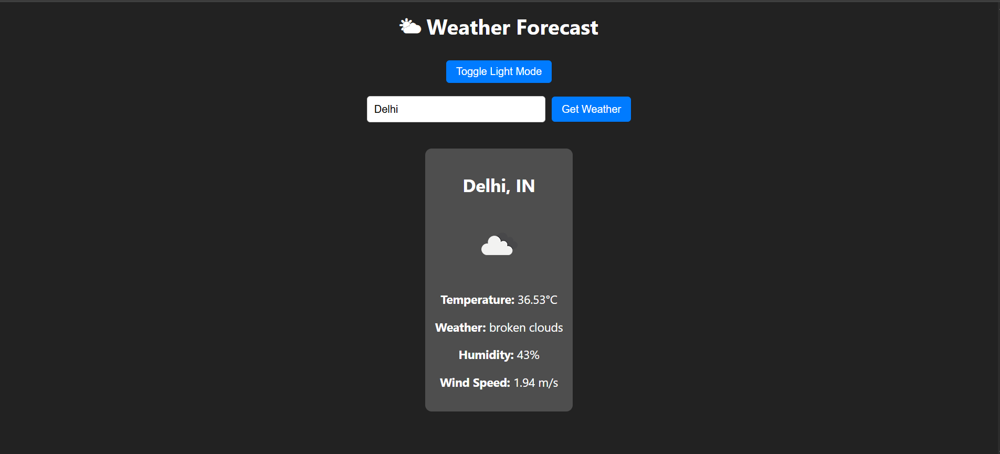

# ⛅ Weather App

**Weather App** is a simple and responsive web application that provides real-time weather information for any city using **API integration**. Just enter a city name to get current temperature, conditions, humidity, and more.

🌐 **Live App**: [weather176.netlify.app](https://weather176.netlify.app/)

---

## 🔑 Features

- 🔍 Search weather by city name
- 🌡️ View temperature, weather condition, humidity, and wind speed
- 🔄 Real-time data fetched from a public weather API
- 🧑‍💻 Responsive UI design for desktop and mobile
- ⚙️ Easy to customize and expand

---

## 🚀 Tech Stack

- **Frontend**: HTML, CSS, JavaScript
- **API**: OpenWeatherMap API (or any integrated weather API)
- **Deployment**: Netlify

---

## 📸 Screenshots

### 🌦️ Weather Result Example



---

## 📁 Folder Structure

```bash
weather/
├── assets/
├── css/
│   └── style.css
├── js/
│   └── script.js
├── index.html
├── README.md
└── .gitignore
